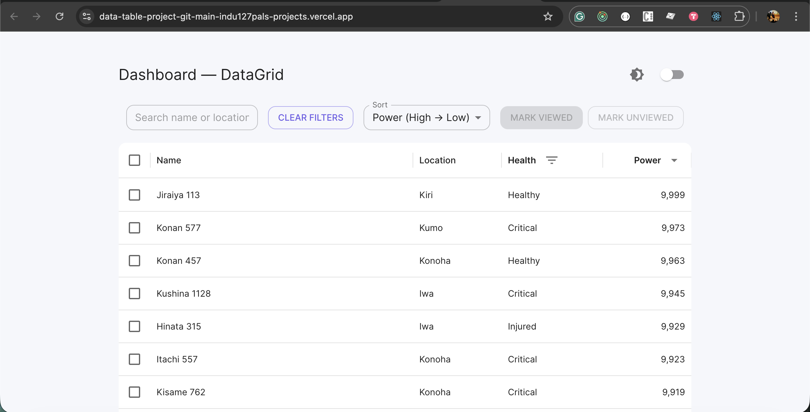
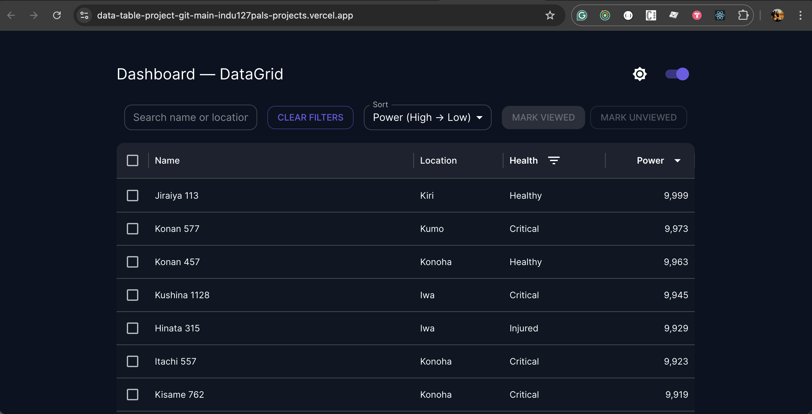

# DataTable FE - Final (Vite + MUI + DataGrid + Storybook + Vitest)

This project includes:
- Vite + React + TypeScript
- MUI 5 with an improved theme
- @mui/x-data-grid with **server-side** pagination & sorting
- Storybook (Vite builder) with MSW mocking
- Vitest tests (mocking axios) for server-side behaviors
- json-server for local fake API and a `generate-db` script

## Quickstart

1. Install dependencies
```bash
npm install
```

2. Optional: Create a `.env` from `.env.example` for local overrides
```bash
cp .env.example .env
```

3. Generate sample DB and start json-server (API: http://localhost:4000)
```bash
npm run generate-db
npm run json-server
```

4. Run the dev server (Vite)
```bash
npm run dev
# open http://localhost:3000
```

4. Run Storybook
```bash
npm run storybook
# open http://localhost:6006
```

4.1 Build Storybook (static)
```bash
npm run build-storybook
# The static output is in the storybook-static directory.
```

To preview the static build locally:
```bash
npx serve storybook-static
# open http://localhost:5000 (or the port serve chooses)
```

5. Run tests
```bash
npm test
```

## Deployment

This project is configured for deployment on **Vercel**. To deploy:

1. Push the repository to GitHub (done).
2. Import the repo into Vercel (New Project → Import Git Repository).
3. Vercel will detect a Vite project, install dependencies and build. If you use the included serverless `json-server` endpoint, ensure `json-server` is listed in `dependencies` (done).

Environment variables (Production):

- `VITE_API_URL` — (optional) set to a custom API base if you use a remote backend. Example for this project when using the built-in serverless handler:

  - `VITE_API_URL=https://<your-vercel-project>.vercel.app/api`

Notes:
- If `VITE_API_URL` is not set, the frontend defaults to calling `/api/characters` which will hit the included serverless `api/server.js` handler.
- The serverless handler uses `api/db.json` as the data source. If the function logs "db.json not found" check that `api/db.json` is checked into Git (not in `.gitignore`).

---

## Live Demo

A live demo of the project is available at:

- Site: [https://data-table-project-git-main-indu127pals-projects.vercel.app](https://data-table-project-git-main-indu127pals-projects.vercel.app)
- API: [https://data-table-project-git-main-indu127pals-projects.vercel.app/api/characters](https://data-table-project-git-main-indu127pals-projects.vercel.app/api/characters)


---

## Demo (screenshot + short video)

You can showcase the app in the README by adding a short animated GIF (recommended) or a small MP4. Place the files in the `public/` folder and reference them from the README. Example of a placeholder image (replace this with your GIF/MP4):


Light and dark mode screenshots:





Short demo video (place `demo-video.mov` or `demo.mp4` in `public/`):

[Download demo video](./public/demo-video.mov)

To embed an MP4 directly in the README (GitHub may not autoplay):

<video controls loop muted playsinline width="640">
  <source src="/demo.mp4" type="video/mp4" />
  Your browser does not support the video tag.
</video>

To add a short working video:

- Record a 5-10s clip (QuickTime, OBS).
- Convert to GIF to embed in the README (recommended for quick previews):
  - Using ffmpeg:

```bash
# create a 5s clip
ffmpeg -ss 00:00:02 -t 5 -i demo.mp4 -vf "fps=15,scale=640:-1:flags=lanczos" -loop 0 public/demo.gif
```

- Or keep an MP4 and host it in `public/demo.mp4`. Linking works; embedding may be browser-dependent:

```html
<video controls loop muted playsinline width="640">
  <source src="/demo.mp4" type="video/mp4" />
  Your browser does not support the video tag.
</video>
```

---

## Production API (vercel)

After deploying to Vercel using the included `api/server.js` handler, your `json-server` is available at `/api`.

- Example endpoints:
  - List characters (first page): `/api/characters?_page=1&_limit=25`
  - Search by text: `/api/characters?q=naruto`
  - Filter by `health`: `/api/characters?health=Healthy&health=Injured`

The app constructs the characters endpoint from `VITE_API_URL` if set, otherwise it falls back to `/api/characters`.

- To configure your production API base in Vercel, set an Environment Variable `VITE_API_URL` to the API base (not the characters path). Example:

  - `VITE_API_URL=https://data-table-project-six.vercel.app/api`

If you set `VITE_API_URL` to a full endpoint that already ends with `/characters` it will still be used correctly.

You can test the API from your browser or using `curl`:

```bash
curl 'https://data-table-project-git-main-indu127pals-projects.vercel.app/api/characters?_page=1&_limit=25'
```

## Notes on server-side DataGrid

- The DataTable component builds requests to `${VITE_API_URL}/characters` when `VITE_API_URL` is set, otherwise it defaults to `/api/characters`.
  - For local development, set `VITE_API_URL=http://localhost:4000` (or run `npm run json-server` and leave this unset to use `/api/` proxied to `http://localhost:4000` via Vite config).
  - In production (when deployed on Vercel), the `json-server` is available as a serverless function at `/api` (requests go to `/api/characters`).
- Query params supported:
  - `_page` (1-based), `_limit`
  - `_sort` and `_order`
  - `q` for full-text search
  - repeated `health` params for multi-select filter (e.g. `health=Healthy&health=Injured`)
- `json-server` returns `x-total-count` header which the app uses for pagination.
- The project includes a serverless handler at `api/server.js` and a `vercel.json` rewrite so `/api/*` is served by `json-server` in production.

## Files changed / important files

- `src/components/DataTable.tsx` — server-side example + UI controls for sorting/pagination
- `scripts/generate-db.ts` — creates `server/db.json` with 600 rows
- `server/db.json` — included so app runs without generation
- `src/components/DataTable.test.tsx` — Vitest tests that mock axios

## Troubleshooting

- If `npm run generate-db` complains about ts-node/tsx:
  - Ensure dev dependency `tsx` is installed: `npm install -D tsx`
  - Or run `node scripts/generate-db.js` after converting the script to JS.

If you want CI, Docker, or a deployed demo, tell me and I'll add it.

